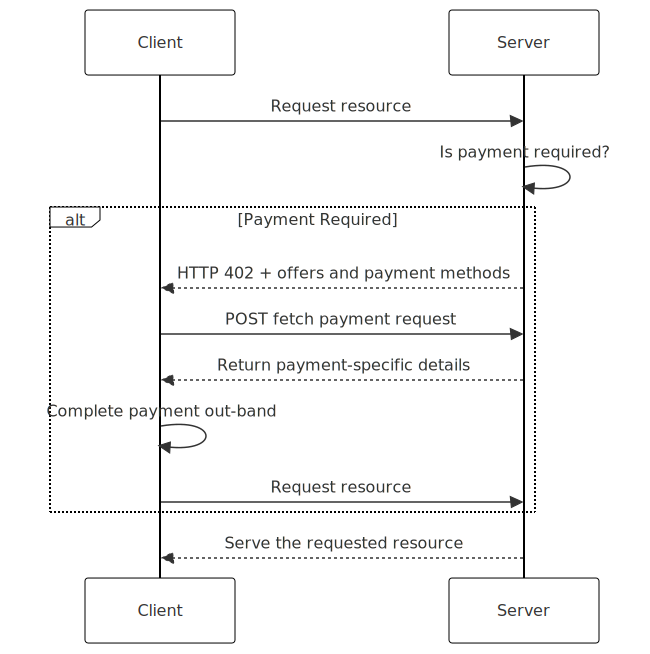

# L402: A Simplified Payment Protocol for the Web

**Enabling machine-friendly transactions through a minimalist HTTP-based payment standard**

## Key Features

L402 simplifies web payments through:

- **HTTP-based flow**: Uses HTTP 402 status code with a Location header pointing to payment endpoint
- **Optional price indication**: X-Price header provides payment amount in any response
- **Minimalist approach**: Removes complex JSON payloads for simpler integration
- **Payment agnostic**: Compatible with any payment system or cryptocurrency
- **Machine-friendly**: Designed for AI agents and automated systems to handle payments seamlessly

## Introduction

*L402 makes payments a core part of HTTP interactions by leveraging the HTTP 402 status code*

The internet's design largely overlooked payments, despite HTTP reserving the 402 "Payment Required" status code. Payment solutions have typically centered around human interactions and checkout flows, which worked for traditional web browsing but present challenges for autonomous systems and AI agents that operate independently through APIs.

L402 addresses this gap by creating a machine-friendly payment protocol. By using HTTP 402 status codes with a simple Location header redirecting to payment endpoints, L402 enables AI agents and automated systems to handle payments without human intervention.

## Protocol

The L402 protocol streamlines payment handling for HTTP resources through a simple redirect-based flow.

### How It Works

1. **Initial Request**
   - Client requests an HTTP resource
   - If payment is required, server responds with HTTP 402
   - Response includes a Location header pointing to the payment endpoint
   - Optional X-Price header indicates the amount (e.g., "0.01 USD")

2. **Payment Processing**
   - Client follows the Location header to the payment endpoint
   - Payment endpoint handles the transaction details
   - After payment, the client can request the original resource again
   - Server verifies payment and provides access to the resource

### Headers Specification

1. **Location Header (Required with 402)**
   - Points to the payment endpoint URL
   - Example: `Location: https://api.example.com/pay/item-123`

2. **X-Price Header (Optional)**
   - Can be included with any status code (not just 402)
   - Format: `X-Price: <amount> [<currency>]`
   - Default currency is USD if none specified
   - Examples:
     - `X-Price: 0.01` (1 cent USD)
     - `X-Price: 0.01 USD` (1 cent USD)
     - `X-Price: 10 EUR` (10 euros)
     - `X-Price: 0.0001 BTC` (Bitcoin amount)

### Example Flow

**Initial Request:**
"""
GET /premium-content HTTP/1.1
Host: api.example.com
"""

**Server Response (Payment Required):**
"""
HTTP/1.1 402 Payment Required
Location: https://api.example.com/pay/premium-content-123
X-Price: 0.50 USD
"""

**Client makes payment at the Location URL and then retries:**
"""
GET /premium-content HTTP/1.1
Host: api.example.com
Authorization: Bearer payment_token_xyz
"""

**Server Response (After Payment):**
"""
HTTP/1.1 200 OK
Content-Type: application/json

{
  "premium_content": "Here is the content you paid for."
}
"""

## Benefits

- **Simplicity**: Minimal implementation requirements make adoption easy
- **Flexibility**: Works with any payment system through the Location redirect
- **Machine Readability**: Clear protocol for automated systems
- **Backward Compatibility**: X-Price header works with any status code
- **Standardization**: Consistent approach across different services

## Contributing

We welcome contributions to L402! Here's how you can get involved:
1. Join our community: Connect with other contributors and stay updated on L402's development by joining our [Discord community](https://discord.gg/2tPYBgWzQm).
2. Report issues: If you encounter a bug or have a feature request, please open an issue on GitHub.
3. Submit Pull Requests: If you're ready to contribute code, fork the repository and submit a pull request.
4. Documentation: Improving documentation is always appreciated. You can help by expanding explanations, adding examples, or updating outdated content.