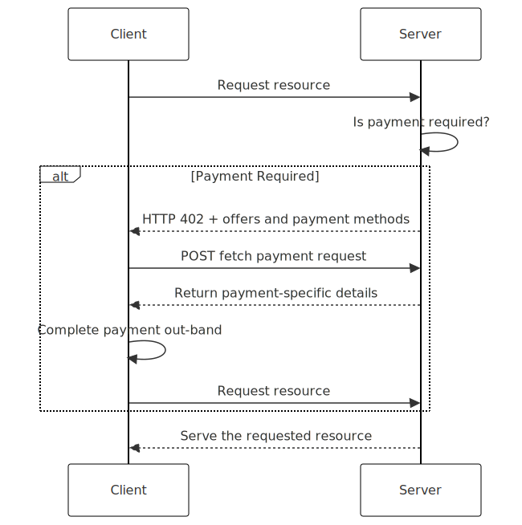

# L402: The Missing Link in Internet Payment Infrastructure


**In today's AI-driven world, L402 bridges the gap between automation and payments, enabling machine-friendly transactions where traditional human-centric payment flows fall short.**

## Key Features

L402 simplifies and automates the process of handling payments on the internet, allowing seamless integration into digital workflows. It leverages HTTP as a foundation to standardize how payments are requested and processed, making it easier for AI agents and automated systems to interact with services.


- **HTTP-based flow**: simplifies payment handling by using HTTP 402 status codes and JSON payloads, allowing clients to request resources, pay and access them seamlessly.
- **Standarize payment requests**: services indicate payment requirements, making integration predictable and easier for developers to implement across different systems.
-  **Payment agnostic**: works with a variety of payment solutions, from services like Stripe to cryptocurrencies, offering developers the flexibility to use the payment network that best fits their needs.
- **Designed for automation**: enables seamless, autonomous transactions between services and AI agents, removing the need for human intervention in payment processes.
- **Extensible and open source**: built to be open and adaptable, making it easy to extend and integrate with future payment solutions and evolving technologies.

## Introduction

*L402 makes payments a core part of HTTP interactions by leveraging the HTTP 402 status code*

Payments were largely an afterthought in the internet's original design, even though the HTTP protocol reserved the 402 "Payment Required" status code for future use. Instead, payment solutions evolved around human-centric processes and relied on networks like Visa and Mastercard, making manual checkout flows the standard. This worked well for traditional web interactions, where payments were either preconfigured or managed manually by users.

With the rise of autonomous systems and AI agents that discover and interact with services independently, the limitations of these human-centric payment flows are becoming clear. These agents interact primarily through APIs and bypass browser-based interfaces, revealing a need for a payment model that supports automated, real-time transactions without human setup.

L402 addresses this gap by making payments "machine-friendly" on the internet. Leveraging HTTP's 402 status code and JSON payloads, L402 standardizes how services request payments directly within HTTP interactions, enabling AI agents and automated systems to handle payments as naturally as data exchange. This transforms payments into a core, automated component of the web.

## Protocol

This sequence diagram illustrates how the L402 protocol streamlines the process of handling payments for HTTP resources. 




The interaction begins when a client requests access to a resource and the server checks if payment is needed. If payment is required, the server responds with details, allowing the client to complete the transaction. After verifying the payment, the server grants access to the resource. This workflow enables automated and seamless payment interactions over HTTP.

1. **Initial Discovery (Step 1)**
   - Client requests access to an HTTP resource
   - Server responds with HTTP 402 and offer details
   - Response includes details about each one of the available offers, a `payment_request_url` and payment methods for each offer

2. **Payment Processing (Step 2)**
   - Client selects an offer and payment method
   - Client requests specific payment details via `payment_request_url`
   - Server generates and returns payment-specific details
   - Client completes payment using the provided details
   - Client re-requests the resource
   - Server serves the requested resource

### Payment Types

L402 supports three primary payment types, each designed for different use cases:

1. **One-time Payments**
   - Simplest form of payment for single-use access
   - Ideal for: e-commerce transactions, individual content access, pay-per-view content, or one-off API calls
   - No additional required fields

2. **Subscription Payments**
   - Enables recurring access for a specified duration
   - Required field: `duration` (examples: "1 month", "1 year", "30 days")
   - Best suited for: SaaS products, membership services, content platforms, or recurring API access
   - Allows services to provide sustained access without repeated payments

3. **Top-up Payments**
   - Preload a balance for future use
   - Required field: `balance` (numerical value representing available credits/tokens)
   - Perfect for: API usage credits, digital wallet systems, prepaid services
   - Enables micro-transactions without repeated payment overhead

Example usage scenarios:
- An flight/hotel provider might use **one-time** payments for a given trip.
- A SaaS platform could use **subscriptions** for ongoing access to its API.
- A developer platform might implement **top-up** payments where users pre-purchase API credits.

### 402 response format

```json
{
  "version": "0.2.2",
  "payment_request_url": "https://api.example.com/l402/payment-request",
  "payment_context_token": "pct_abc123xyz",
  "offers": [
    {
      "id": "offer_12345",
      "title": "One-time Access",
      "description": "Access to the resource for a single session",
      "type": "top-up",
      "balance": 1,
      "amount": 100,
      "currency": "USD",
      "payment_methods": ["lightning", "onchain"]
    },
    {
      "id": "offer_67890",
      "title": "Monthly Subscription",
      "description": "Unlimited access for 30 days",
      "amount": 1500,
      "currency": "EUR",
      "type": "subscription",
      "duration": "1 month",
      "payment_methods": ["credit_card", "lightning", "onchain"]
    }
  ],
  "terms_url": "https://example.com/terms",
  "metadata": {
    "resource_id": "resource_abc",
    "client_note": "Payment required for premium content"
  }
}
```

### Payment request format

After selecting an offer from the L402 response, clients request specific payment details. Using the example above, to get payment details for offer `offer_12345` using Lightning Network:

```bash
curl -X POST https://api.example.com/l402/payment-request \
  -H "Content-Type: application/json" \
  -d '{
    "offer_id": "offer_12345",
    "payment_method": "lightning",
    "payment_context_token": "pct_abc123xyz"
  }'
```

The `onchain` payment type expects two extra fields `chain` and `asset`.

```bash
curl -X POST https://api.example.com/l402/payment-request \
  -H "Content-Type: application/json" \
  -d '{
    "offer_id": "offer_12345",
    "payment_method": "onchain",
    "chain": "base-mainnet",
    "asset" "usdc",
    "payment_context_token": "pct_abc123xyz"
  }'
```


The server responds with payment method-specific details:

```json
{
  "version": "0.2.2",
  "payment_request": {
    "lightning_invoice": "lnbc50n1p3hk3etpp5...",
  },
  "expires_at": "2024-03-20T15:30:00.123Z"
}
```

The `payment_request` field varies based on the selected payment_method:

- `checkout_url`: A checkout URL (ex: Stripe payment link or Coinbaise commerce checkout page)
- `lightning_invoice`: A lightning invoice string
- `address`: On-chain contract address


Payment methods will have only one of the fields. In the case of onchain transactions, the address returned will correspond to the requested asset and chain.

```json
{
  "version": "0.2.2",
  "payment_request": {
    "address": "0x1FA57f87941...",
    "asset": "usdc",
    "chain": "base-mainnet"
  },
  "expires_at": "2024-03-20T15:30:00.123Z"
}
```

## Contributing

We welcome contributions to L402! Here's how you can get involved:
1.	Join our community: Connect with other contributors and stay updated on L402's development by joining our [Discord community](https://discord.gg/2tPYBgWzQm).
2.	Report issues: If you encounter a bug or have a feature request, please open an issue on GitHub.
3.	Submit Pull Requests: If you're ready to contribute code, fork the repository and submit a pull request. Be sure to follow our coding guidelines and include relevant tests.
4.	Documentation: Improving documentation is always appreciated. You can help by expanding explanations, adding examples, or updating outdated content.

## Implementation Resources

To help you get started with L402, we provide several resources:

### Example Implementations

- [L402 Server Example](https://github.com/l402-protocol/l402-server-example): A working implementation of a server that uses L402 for a Stock Data API, demonstrating how to integrate payment processing using Lightning Network, Stripe, and Coinbase Commerce.

- [L402 Client Example](https://github.com/l402-protocol/l402-client-example): Example implementations of L402 protocol clients using various frameworks (OpenAI, LangChain, CrewAI) and payment methods like Lightspark, with more coming soon.

### LLM Integration

We provide a [`llms.txt`](https://github.com/l402-protocol/llms.txt) file that follows the [llms.txt specification](https://llmstxt.org/). This standardized file helps AI assistants and IDE integrations better understand the L402 protocol. When using AI tools like Cursor or other LLM-powered development environments, this file provides structured, concise information about the protocol, its implementation, and important resources.

These resources provide practical examples that you can adapt for your own services, making it easier to implement machine-friendly payment flows.